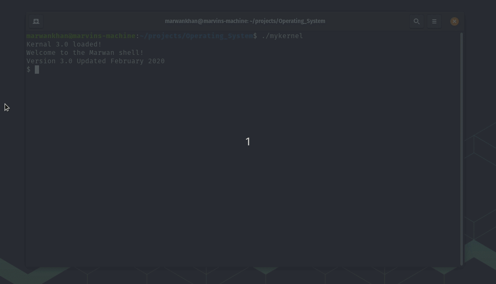

# Operating_System
A Simulation that uses first in first in first out paging technique to run up to 3 scripts, as well as handles task switching where each process has 2 quantas, which was achieved by assigning a process control block to each process. Directory called "BackingStore" is used to simulate the backing store where all the files are stored. The files in the backing store are erased once the operating system quits (as shown in the demo).

## Available commands

**help**: Displays all commands

**quit**: Exits the shell with "Bye!"

**set VAR STRING**: Assigns a value to shell memory

**print VAR**: Displays the STRING assigned to VAR

**run SCRIPT**: Executes the file SCRIPT.TXT

**exec SCRIPT1 SCRIPT2 SCRIPT3**: executes the entered files

## Demo

## Running Instructions

In order to run the operating system run the following command in your terminal:

`./mykernel`

**Note:**

-Please do not put space after the value when setting variables. (eg. set canada montreal NOT set canada montreal ).

-When using a test file as standard input please make sure the file ends with the quit command.

-Please do not end scripts with a new line.
